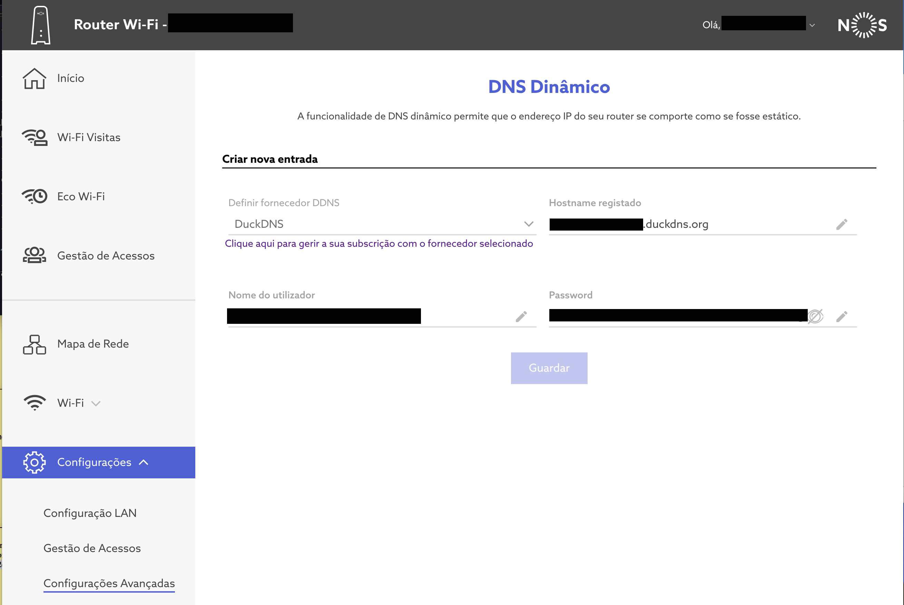
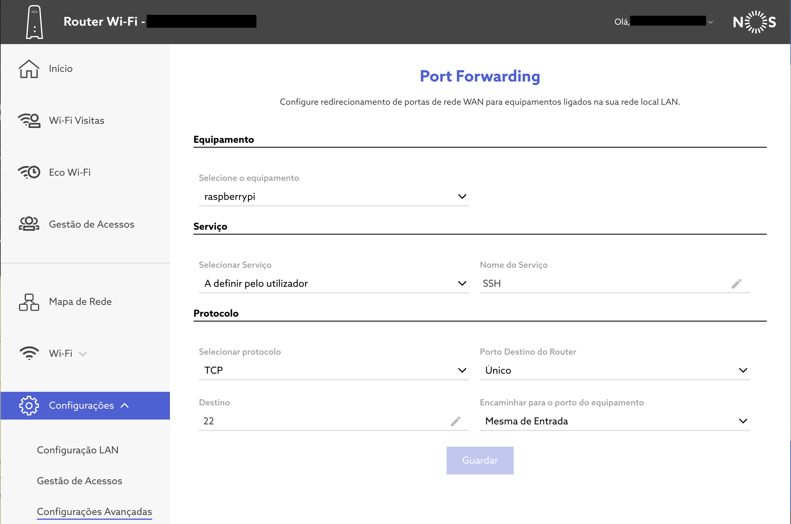

# DNS

## Dynamic DNS

There are several free Dynamic DNS providers. We're going to stick with [Duck DNS](https://www.duckdns.org/). It is easy to use and goes to great lengths to [help setup](https://www.duckdns.org/install.jsp).

```bash
# Create update script (script is below)
sudo touch /usr/local/bin/duck.sh
sudo chown $USER /usr/local/bin/duck.sh
# Assumes the groups name is the same as the user's name (change accordingly if necessary)
sudo chgrp $USER /usr/local/bin/duck.sh

# Create Systemd job and timer
sudo touch /etc/systemd/system/duck.service
sudo touch /etc/systemd/system/duck.timer
```

Script for `/usr/local/bin/duck.sh`:

```shell
#!/usr/bin/env sh

DOMAIN='<MY_DOMAIN>'
TOKEN='<MY_TOKEN>'

curl --silent --show-error "https://www.duckdns.org/update?domains=$DOMAIN&token=$TOKEN"
```

Systemd service:

```bash
[Unit]
Description=Duck DNS
After=network-online.target
Wants=network-online.target

[Service]
ExecStart=/usr/local/bin/duck.sh

[Install]
WantedBy=multi-user.target
```

Systemd timer:

```bash
[Unit]
Description=Update Duck DNS every 5 minutes

[Timer]
OnCalendar=*-*-* *:00/5:00
Persistent=true

[Install]
WantedBy=timers.target
```

Enable Systemd:

```bash
# Enable
systemctl enable duck.service
systemctl enable duck.timer

# Start
systemctl start duck.timer

# Watch
systemctl list-timers
journalctl -u duck.service
```

### Router configuration for automatic IP update

#### Vodafone

I've not yet successfully configured the router to work with Duck DNS. I've tried setting up with [GnuDIP.http](https://www.duckdns.org/install.jsp), but no matter the parameters I set, it always fails. My guess is that where I am supposed to enter the server address, the router fails when setting a URL with a request path (`duckdns.org/gnudip/`). Trying to set DynDNS also failed.

#### NOS

NOS natively integrates with Duck DNS. Just pass the parameters:


## Port forwarding

We can expose the Raspberry Pi to the internet with port forwarding. That way only a few ports will be publicly available. If we want to expose it completely, then placing it in the [DMZ](https://en.wikipedia.org/wiki/DMZ_(computing)) may be preferable.

### Setting a static IP address

Setting a static local IP address can be a good idea. Although with mDNS we have no need to remember IP address of the devices on our local network, the router is free to assign a different IP address each time the Raspberry Pi connects to it. The problem comes up when the configurations for port forwarding to a device is by IP (and not by MAC address, for example). It may happen that another device gets the IP address we previously exposed with port forwarding.

As a possible solution, we can set a static IP address on the Raspberry PI by editing `/etc/dhcpcd.conf`. Look for the entry `ip_address` for the interface `wlan0` and choose there the IP you want. Here is an example:

```shell
interface wlan0
        static ip_address=192.168.1.254/24
        static routers=192.168.1.1
        static domain_name_servers=192.168.1.1
```

Usually routers assign IPs starting by the lower ranges (0, 1, 2, ...), by choosing the a number from the top (e.g., 254) we reduce the possible risk of collision (the router assigning that IP to another device). We may even reduce the interval for the DHCP pool to prevent this collision.

### Vodafone

- Endpoint: http://192.168.1.1
- Default Username: `vodafone`
- Default Password: `vodafone`

Enable port forwarding for the necessary ports. Enabling SSH (port 22) would be:


Checking the external IP is also easily available:


Expose ports as you like.

### NOS

- Endpoint: http://192.168.1.1
- Account: NOS personal account

An example of setting SSH access:


## Useful resources

- [Comparison between Dynamic DNS providers](https://www.maketecheasier.com/best-dynamic-dns-providers/)
