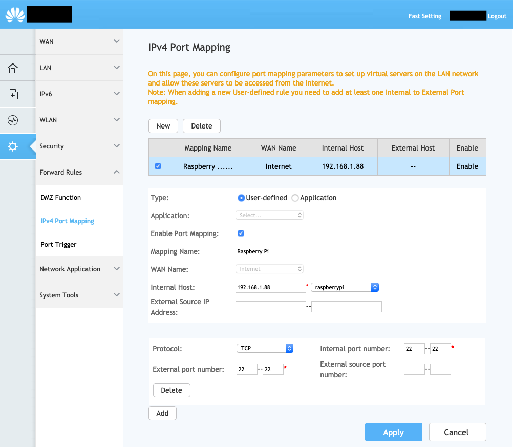
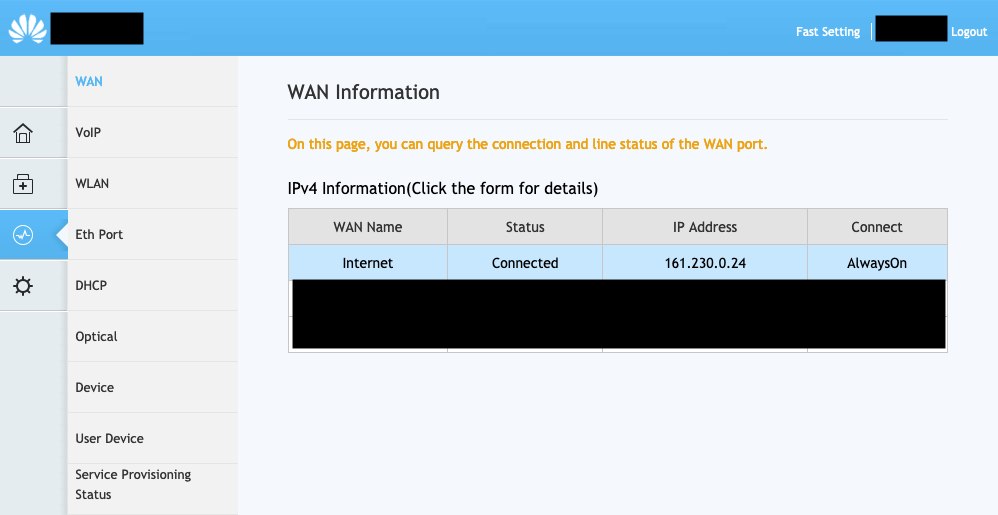

# DNS

## Dynamic DNS

There are several free Dynamic DNS providers. We're going to stick with [Duck DNS](https://www.duckdns.org/). It is easy to use and goes to great lengths to [help setup](https://www.duckdns.org/install.jsp).

```bash
# Create update script (script is below)
sudo touch /usr/local/bin/duck.sh
sudo chown $USER /usr/local/bin/duck.sh
# Assumes the groups name is the same as the user's name (change accordingly if necessary)
sudo chgrp $USER /usr/local/bin/duck.sh

# Create Systemd job and timer
sudo touch /etc/systemd/system/duck.service
sudo touch /etc/systemd/system/duck.timer
```

Script for `/usr/local/bin/duck.sh`:

```shell
#!/usr/bin/env sh

DOMAIN='<MY_DOMAIN>'
TOKEN='<MY_TOKEN>'

curl --silent --show-error "https://www.duckdns.org/update?domains=$DOMAIN&token=$TOKEN"
```

Systemd service:

```bash
[Unit]
Description=Duck DNS
After=network-online.target
Wants=network-online.target

[Service]
ExecStart=/usr/local/bin/duck.sh

[Install]
WantedBy=multi-user.target
```

Systemd timer:

```bash
[Unit]
Description=Update Duck DNS every 5 minutes

[Timer]
OnCalendar=*-*-* *:00/5:00
Persistent=true

[Install]
WantedBy=timers.target
```

Enable Systemd:

```bash
# Enable
systemctl enable duck.service
systemctl enable duck.timer

# Start
systemctl start duck.timer

# Watch
systemctl list-timers
journalctl -u duck.service
```

## Port forwarding

### Vodafone

- Endpoint: http://192.168.1.1
- Default Username: `vodafone`
- Default Password: `vodafone`

Enable port forwarding for the necessary ports. Enabling SSH (port 22) would be:



Checking the external IP is also easily available:



Expose ports as you like.

## Useful resources

- [Comparison between Dynamic DNS providers](https://www.maketecheasier.com/best-dynamic-dns-providers/)
