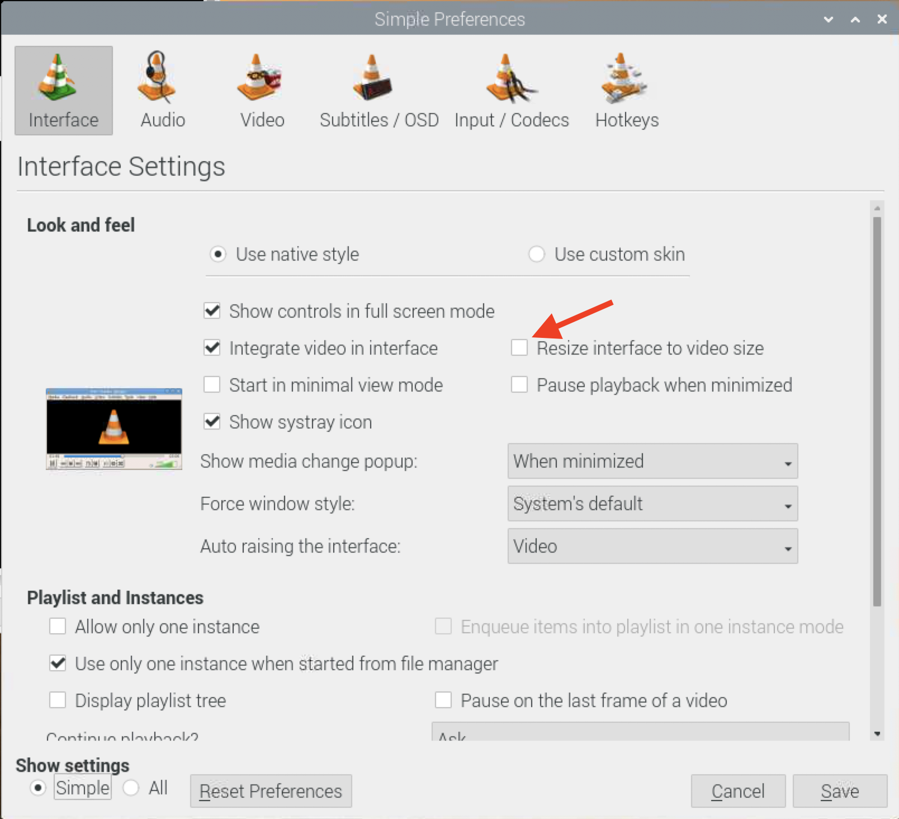

# Media Player

This setup is not the final solution, but it is a stopgap that is easy and just works.

## VLC

VLC will be the default player for several reasons like ease of use, familiarity and available remote clients.

For the remote client we can use [VLC Remote](https://hobbyistsoftware.com/VLCSetup) with available apps for [iOS](https://hobbyistsoftware.com/vlc-more) and [Android](https://hobbyistsoftware.com/android/vlc-more). I've been using it for a while as it allows to browse the remote filesystem and select files from there. We just need to start VLC on the Raspberry Pi and we can then use the app. Stopping VLC requires killing the process.

To support VLC Remote, we need to change some configs on VLC itself. There is a [guide available online](https://hobbyistsoftware.com/VLCSetup-linux) or we can use the terminal to add the following to the [config file](https://wiki.videolan.org/Preferences/) (`~/.config/vlc/vlcrc`):

```bash
http-password=vlcremote
vod-server=any
extraintf=http
```

If a firewall is enabled (e.g., ufw), then allow local connections:

```bash
# Check IP and Mask
ifconfig

# Allow local connections to port 8080
ufw allow from <IP>/<MASK> to any port 8080 comment VLC
```

To start and stop VLC:

```bash
# Start VLC
# Append `&` at the end to not block
DISPLAY=:0 vlc

# Kill VLC
pkill vlc
```

### iOS Shortcuts

I've got an iOS device and I created two shortcuts to ease the process. They are very simple, and execute the start and stop VLC commands through SSH on the host. Starting VLC makes use of [GNU Screen](https://savannah.gnu.org/projects/screen) (`sudo apt install screen`) to allow execution of remote commands without waiting staying connected. It is highly recommended authenticating through SSH key.

I haven't yet figured out how to export the shortcuts to a file, but they just execute the commands from the previous section except for start which is preceded by `screen -d -m`.

### Known issues

VLC stutters on large files. There is no need to compile ourselves to get hardware acceleration. We should get it [out of the box](https://www.raspberrypi.org/forums/viewtopic.php?f=66&t=195221). One fix that seems to be working is to reduce the window size. The problem goes away even in full screen. We can set the window size on each execution, but I prefer to prevent the window from adjusting to the video size. We've got two ways of doing that. Either set `qt-video-autoresize` to `0` in the config file, or change in the preferences menu:


