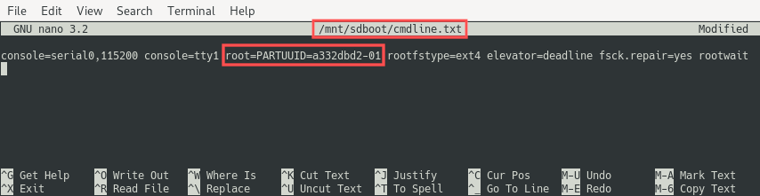

# Move the Raspberry PI root file system to a USB drive

https://www.pragmaticlinux.com/2020/08/move-the-raspberry-pi-root-file-system-to-a-usb-drive/

A Raspberry PI is a wonderful and powerful little computer. You can even run it as a server 24/7 all year round. There is just one snag: sooner or later the SD card gets corrupted during a write operation. Moving the root file system of your Raspberry PI to an external USB drive bypasses this problem. This article presents instructions on moving the root file system from the SD card to an external USB drive, such that you can boot your Raspberry PI with the root file system on the USB drive.

## Background

Google the phrase “Raspberry PI SD card corruption” and soon you’ll realize that this is a serious concern. Especially if you plan on running your Raspberry PI as a server 24/7. For some their Raspberry PI server runs without problems for over a year, others that are less lucky need to replace the SD-card several time a year.

When does this problem with the SD card occur? Well, only during write operations. So, if we can figure out a way to not write to the SD card, the problem is solved. One solution is by storing the Raspberry PI root file system on a USB drive, instead of the SD card. This article presents clear step-by-step instructions on moving the root file system from your Raspberry PI SD card to an external USB drive. Afterwards you can boot your Raspberry PI with the root file system located on the USB drive.

When should you move the Raspberry PI root file system to a USB drive? Ideally right after you installed the Raspbian operating system and booted your Raspberry PI for the first time with it.

## What you need

I assume that you already own a Raspberry PI, with a micro SD card and a suitable power supply. Furthermore I assume that you already installed [Raspbian](https://www.raspberrypi.org/downloads/) (the Raspberry PI operating system based on Debian) on the SD card. In case you haven’t yet installed the operating system, you can follow the instructions from a [previous article](https://www.pragmaticlinux.com/2020/06/setup-your-raspberry-pi-4-as-a-headless-server/), covering the steps to setup your Raspberry PI as a headless server.

In addition you need the actual USB drive. Ideally a high quality 2.5″ SATA SSD drive (such as the Samsung 860 PRO) in combination with a USB 3.0 to 2.5″ SATA III adapter. If you first want to try out the steps in this article, before investing into these additional parts, a simple USB flash drive of 8GB or greater suffices for testing purposes.

In general, the procedure outlined in this article works on any Raspberry PI model. Note however that the Raspberry PI 4 features a USB 3.0. The USB 3.0 offers much higher read/write speeds compared to the USB 2.0 found on the older Raspberry PI models. In fact, if you store the root file system on a SATA SSD drive, which is connected to the your Raspberry PI 4 with a USB 3.0 to SATA adapter, it performs even better than with an SD card.

The actual move of the Raspberry PI’s root file system to the USB drive will be done with a Linux based PC. My laptop runs Debian 10, but you can use whatever Linux distribution you prefer for this. This does mean that we’ll connect both the USB drive and the micro SD card of the Raspberry PI to our PC. Therefore you might need to get an adapter for inserting the micro SD card to your PC.

## Overview of Raspbian partitions

To understand why moving the Raspberry PI root file system from the SD card to a USB drive prevents SD card corruption, you need a basic understanding of the Raspbian partitions. I inserted the Raspberry PI SD card into my PC. After this the partitions got automatically mounted in my case. If you do this, you’ll notice that the Raspberry PI operating system occupies two partitions. Below you can see a screenshot from the [Double Commander](https://www.pragmaticlinux.com/2020/06/getting-started-with-double-commander/) twin panel file manager that shows both partitions:


### The rootfs partition

On the right side of the previous screenshot you can see the root file system partition. This is the one that gets mounted at `/` when the Raspberry PI boots up. It is also the one that we will move to the USB drive in this article. It contains all the files that you as a user can see when you logged into your Raspberry PI. Linux does the majority of its read and write operations to this partition. For example, it often writes to log files in `/var/log`. You as a user also perform write operations to this partition. For example to your `/home` directory. Due to the write operations to this partition, the chances of SD card corruption increase. Hence the idea to move this entire partition to a USB drive.

### The boot partition

The boot partition contains files needed just for booting up the Linux operating system. The Raspberry PI expects this boot partition on the SD card, otherwise it can’t boot. Upon power-up, the CPU starts the actual bootloader, which is located in `bootcode.bin` . The bootloader loads and starts the firmware program in the `start.elf` file. This program in turn loads the actual Linux kernel from `kernel.img` into RAM. It passes the arguments found in `cmdline.txt` to the kernel and then gives control to the Linux kernel. Once the Linux kernel gets control, it continues with booting up your Raspberry PI operating system.

This is probably more information than you really wanted. The important take away here is that only read operations are performed on this partition. Consequently, we do not have to fear SD card corruption on the boot partition. The only time a write operation on this partition is performed, is when a new kernel with security fixes is installed during a system update. This happens only a few times a year and therefore the risk of SD card corruption is negligible.

## Insert the USB drive and SD card into your PC

To move the Raspberry PI root file system to a USB drive, we will use our own Linux PC. You shouldn’t attempt to perform these steps directly on the Raspberry PI, because then the root file system is in use. Consequently, copying all files from the root file system might fail.

As a first step, make sure your Raspberry PI is powered down. Remove the SD card from the Raspberry PI and insert it into your PC. Afterwards connect the USB drive to your PC. With both devices connected to your PC, we need to figure out the assigned device names. Run the following command for listing all disks and partitions on your PC. The `-p` parameter make sure that the command output includes the full device name:

`lsblk -p | grep "disk\|part"`


After inspecting the command output we learn that `/dev/sda` is my PC’s hard disk and the one we really shouldn’t touch at all. Upon insertion, Linux assigned the `/dev/sdb` device name to the USB drive. The USB drive currently contains one partition (`/dev/sdb1`), which doesn’t matter because we intend to reformat the USB drive in the next section. Linux assigned the `/dev/mmcblk0` device name to the SD card. As expected, the SD card contains two partition: the boot partition (`/dev/mmcblk0p1`) and the root file system partition (`/dev/mmcblk0p2`).

For the remainder of the article, I will use these device names in the examples. However note that the device names, which your PC assigned, could be different. Make sure to substitute the device names accordingly in the subsequent commands.

Now that we know the device names, we just need to make sure the partitions are not mounted before continuing. The unmount the partitions, run these commands:

```bash
sudo umount /dev/sdb1  
sudo umount /dev/mmcblk0p1  
sudo umount /dev/mmcblk0p2
```

## Create and format an EXT4 partition on USB drive

Before we can copy the files from the SD card’s root file system to the USB drive, we need to create one large EXT4 partition on the USB drive and then format this newly created partition. Note that this deletes all files that are currently stored on the USB drive. So make sure to make a backup of these files, in case they are important. Also triple check that you specify the correct device name in the following commands. Otherwise you might irreversibly alter the wrong disk.

Start out by creating a new partition table on the disk:

`sudo parted /dev/sdb mklabel msdos`

Next create one big partition. This creates `/dev/sdb1`:

`sudo parted /dev/sdb mkpart primary 0% 100%`

After the creation of the new `/dev/sdb1` partition, format it as EXT4:

`sudo mkfs.ext4 /dev/sdb1`


## Mount the USB drive and SD card partitions

In the previous sections, we unmounted all partitions of the USB drive and the SD card. Furthermore we created one large EXT4 partition on the USB drive. In this section we create new mount points for all three partitions and manually mount the partitions.

Create the mount points with the following three commands:

```bash
sudo mkdir -p /mnt/usbdrive  
sudo mkdir -p /mnt/sdboot  
sudo mkdir -p /mnt/sdrootfs
```

Mount the partitions by running the commands:

```bash
sudo mount /dev/sdb1 /mnt/usbdrive  
sudo mount /dev/mmcblk0p1 /mnt/sdboot  
sudo mount /dev/mmcblk0p2 /mnt/sdrootfs
```

To verify that all worked as intended, run:

`lsblk -p | grep "disk\|part"`


## Copy the SD card root file system to the USB drive

Everything is in place to proceed with the actual root file system copying. The goal is to copy the entire root file system from the SD card to the USB drive. We can easily do this with the help of the `rsync` program. Run the following command. Note that it can take a few minutes for the copy operation to complete:

`sudo rsync -axv /mnt/sdrootfs/* /mnt/usbdrive`


## Remap the root partition

With the root file system copied to the USB drive, we need to inform the Raspberry PI operating system to actually use this one and not the one of the SD card. This needs to be done in two locations:

1.  In the command line parameters that the bootloader passes to the Linux kernel.
2.  In the file system table file (fstab) that informs the Linux kernel how to mount the file systems.

To make these changes, we first need to figure out the PARTUUID of the partition on the USB drive. So the partition that now holds the root file system. The abbreviation PARTUUID stands for universally unique partition identifier. The device name of this partition is `/dev/sdb1`. Run this command to determine the its PARTUUID:

`sudo blkid | grep "/dev/sdb1"`


In my case it is `a332dbd2-01`, but it will be different for you. Therefore make sure to substitute your PARTUUID whenever I use `a332dbd2-01`.

### Update PARTUUID in kernel parameters

The parameters that the bootloader passes to the kernel are located in file `cmdline.txt` on SD card’s boot partition. One of the parameters is the PARTUUID of the partition holding the root file system. Let’s make a backup copy of this file first:

`sudo cp /mnt/sdboot/cmdline.txt /mnt/sdboot/cmdline.org`

As a next step, edit this file with the Nano terminal text editor. Refer to [this article](https://www.pragmaticlinux.com/2020/05/first-steps-with-the-nano-text-editor/) for a brief refresher on editing files with Nano. Change the PARTUUID to the one of the USB drive partition once you opened the file in Nano:

`sudo nano /mnt/sdboot/cmdline.txt`



### Update PARTUUID in file system table

Once the bootloader gave control to the Linux kernel, the kernel continues booting the operating system. During the boot process, the kernel reads the `fstab` configuration file to determine which partitions need to be integrated into the file system structure and how. This includes the root file system. So we need to change the PARTUUID of the root file system in here, such that the kernel uses the root file system on the USB drive partition.

The `fstab` file is normally located in `/etc/fstab`. Since we mounted the USB drive partition to `/mnt/usbdrive`, the file to edit is `/mnt/usbdrive/etc/fstab`. Let’s make a backup copy of this file first:

`sudo cp /mnt/usbdrive/etc/fstab /mnt/usbdrive/etc/fstab.org`

As a next step, edit this file with the Nano terminal text editor. Change the PARTUUID to the one of the USB drive partition, once you opened the file in Nano:

`sudo nano /mnt/usbdrive/etc/fstab`


Look for the line with `/` (which means root file system on Linux) and change the PARTUUID on that line.

## Unmount the partitions and delete the mount points

At this point you made all the necessary changes for moving the Raspberry PI root file system to the USB drive. As a little cleanup, we can unmount all three partitions again. Since we no longer need the mount point directories, we can delete these as well. Start with unmounting the three partitions:

```bash
sudo umount /mnt/usbdrive  
sudo umount /mnt/sdboot  
sudo umount /mnt/sdrootfs
```

Next delete the mount point directories:

```bash
sudo rmdir /mnt/usbdrive  
sudo rmdir /mnt/sdboot  
sudo rmdir /mnt/sdrootfs
```

## Boot the Raspberry PI

As the grand finale, the time has come to see if we can now boot the Raspberry PI with the root file system on the USB drive. Remove both the SD card and the USB drive from your PC. Next, insert them into your Raspberry PI. Once done, connect the power supply to the Raspberry PI and wait a little bit for the boot process to complete.

Once the Raspberry PI completed booting, we can remotely log in to it via SSH. Instead of the default `pi` user, I created a new user called `pragmalin`, so I connect with the command:

`ssh pragmalin@raspberrypi`

After logging in via SSH, we can run the following command to verify that the Raspberry PI’s root file system is actually on the USB drive:

`lsblk -p`


## Wrap up

After going through the steps outlined in this article, you can now run your Raspberry PI with the root file system on a USB drive. Although these steps required a bit of extra time to get your Raspberry PI setup, you pretty much eradicated the SD card corruption problem. This opens the path to using your Raspberry PI as a low cost and energy efficient Linux server system that can run 24/7 all year round.

Keep in mind that the Raspberry PI 4 features USB 3.0. So if you invest in a good 2.5″ SATA SSD drive, combined with a USB 3.0 to 2.5″ SATA III adapter, you’ll actually get better I/O performance compared to having the root file system on the SD card.
